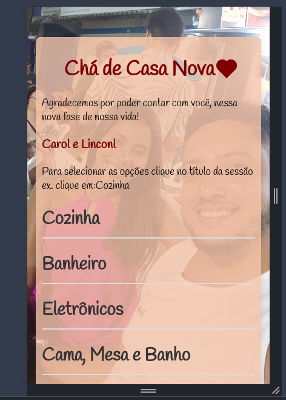

# cha-casanova
# Carol e Linconl

Realizei esse projeto para enviar essa lista para amigos e familiares para conseguirmos montar nossa casa que está pra sair

Fiz o frontend e subi aqui no github pages mesmo e o backend que tem uma api em nodejs consumindo um banco de dados postgres

Funciona com a inserção no frontend com o usuário selecionando o presente e após é salvo no banco de dados atraves da api em node.

Link do projeto : https://linconl-cmd.github.io/cha-casanova/

